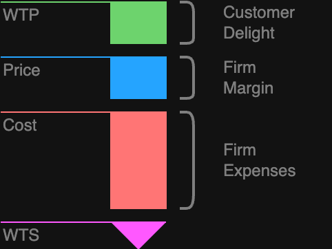

# What Is Value-Based Strategy?

Crafting a winning business strategy is all about developing, aligning, and integrating your organization's strategic initiatives to gain a competitive edge in the market. A well-devised business strategy not only provides a clear roadmap for achieving your goals but also ensures your organization can survive and thrive in a dynamic marketplace.

One effective approach is the value-based strategy. This method simplifies strategic planning by using the value stick framework, which hones in on the unique advantages your business offers, making it easier to focus on what truly sets you apart from the competition.

Value-based strategy is a dynamic method where price-setting and resouce allocation is based on the perceived value of the good or service. This approach ensures that prices reflect what customers believe the product or service is worth.

To visualize and optimize this strategy, the value stick framework is invaluable. It helps you see how different factors interact and guides you in choosing initiatives that maximize value for everyone involved.

**The Value Stick Framework**

The value stick consists of four key factors:

1. **Willingness to Pay (WTP):** The highest price a customer is willing to pay for your product or service.
2. **Price:** The actual amount customers pay for your goods or services.
3. **Cost:** The expenses incurred by the company to produce the goods or services.
4. **Willingness to Sell (WTS):** The minimum amount suppliers are willing to accept for the materials needed to produce your goods or services.

By adjusting each factor on the value stick, you can see how it impacts the others and find the optimal way to create value. For example, lowering the price can boost customer satisfaction and increase demand. The core questions for strategists are:
- “How can my business best create value for customers?
- How can my business create value for employees?
- How can my business create value by collaborating with suppliers?

# 6 Steps To Develop a Value-Based Business Strategy

## 1. Define Your Purpose

Start your business strategy by defining your organization’s purpose. Research in the Harvard Business Review shows that consumers are increasingly motivated to buy from sustainable brands, with sales of such products growing over five times faster than their non-sustainable counterparts.

By beginning with a clear purpose, your organization can lay the groundwork for long-term value creation.

## 2. Assess Market Opportunity

Next, dive into understanding your market’s competitive landscape. Identify which companies dominate the market, how your competitors’ products differ from yours, and any unmet needs that your organization could address.

Conducting this research is critical for pinpointing your unique value proposition and discovering new opportunities to enhance customer value.

## 3. Create Value for Customers

With a clear purpose and market understanding, strategize how to provide unique or greater value to your customers. On the value stick, customer value is known as “customer delight,” which can be increased by raising willingness to pay or lowering the price. If lowering the price isn’t feasible, consider ways to enhance the product’s value, thereby increasing customer willingness to pay.

Ways to create customer value include:

- Lowering the product’s price
- Enhancing product quality and longevity
- Providing exceptional customer service and a seamless shopping experience
- Leveraging network effects to build a community of users
- Integrating environmental or social causes into your branding

## 4. Create Value for Suppliers

Creating value for suppliers is as important as creating value for customers. Suppliers provide the raw materials, labor, and transportation necessary for your business operations. Supplier surplus, or supplier delight, occurs when the cost of materials increases or their willingness to sell decreases.

Ways to create value for suppliers include:

- Paying more for higher quality materials, which can also increase customer delight and your firm’s margins
- Collaborating with suppliers to increase efficiency, reducing their costs and willingness to sell

## 5. Create Value for Employees

An effective business strategy must include creating value for employees. Think of your employees as the “suppliers” of intelligence, with their satisfaction being crucial for overall success. Employee satisfaction can be enhanced by raising wages or delivering value through other means, leading to better customer experiences and increased customer delight.

Examples of creating employee value include:

- Offering competitive salaries and bonuses
- Providing ample paid vacation, sick days, and generous parental leave
- Ensuring flexibility in work location, whether remote or hybrid
- Supporting professional development
- Cultivating a diverse and inclusive workplace
- Fostering a supportive organizational culture

## 6. Map Strategy to Actionable Tasks and KPIs

While creating value for customers, employees, and suppliers, don’t forget the fourth party: your company. By enhancing value for these three groups, you inherently create value for your firm.

To track your progress, establish key performance indicators (KPIs), define success metrics, and plan how you’ll report results over time. Break down each value-creation goal into actionable tasks. For example, what steps are needed to increase employee compensation? Assign responsibilities for each task.

Having clear assignments and metrics for success will ensure a smooth transition from strategy planning to execution.
